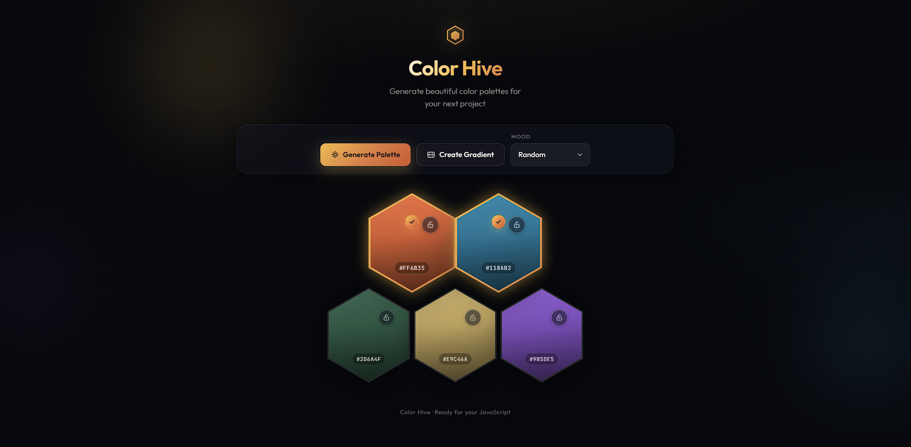
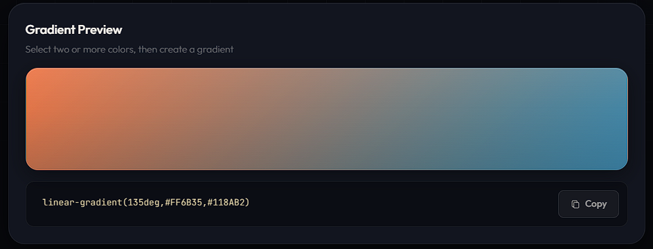

# Color Hive

A premium **color palette generator** built with plain HTML, CSS, and JavaScript — no frameworks, no build tools. Open `index.html` and start exploring moods, locks, and gradients.



---

## Overview

**Color Hive** is a dark, glassmorphic design tool inspired by modern SaaS products. Five honeycomb hexagons form the palette. You can lock colors you like, generate new ones by mood, select two swatches, and export a CSS gradient.

| Layer | Stack |
| --- | --- |
| Markup | HTML5 (semantic structure) |
| Styles | CSS3 (variables, clip-path hexagons, glassmorphism) |
| Logic | Vanilla JavaScript |

---

## Features

### Palette & Honeycomb UI
- Five hexagonal color cells in a honeycomb layout
- Live HEX code display on every cell
- Select up to **2** colors at once (glow border + check badge)
- Lock / unlock per cell so favorites stay when regenerating

### Generate by Mood
Pick a mood, then hit **Generate Palette**. Unlocked cells get new colors from RGB ranges tuned to that mood:

| Mood | Feel | Color direction |
| --- | --- | --- |
| Random | Open exploration | Full spectrum |
| Warm | Energy, passion | Reds, oranges, ambers |
| Cold | Calm, distance | Ice blues, cool cyans |
| Ocean | Depth, trust | Teals, sea blues |
| Nature | Growth, earth | Leaf greens, olive, moss |
| Sunset | Dusk, romance | Orange, coral, violet, gold |
| Cyberpunk | Neon night, tech | Magenta, cyan, electric purple |
| Pastel | Soft, gentle | High lightness, soft contrast |
| Luxury | Elegance, wealth | Gold, burgundy, champagne, navy |
| Neon | Nightlife energy | Extreme saturation, bright accents |

### Gradient Preview
Select two hexes → click **Create Gradient** → preview appears with copyable CSS.



- Large live preview strip
- CSS output like `linear-gradient(135deg, #FF6B35, #118AB2)`
- Copy button UI ready for clipboard wiring

### Design Details
- Dark theme with amber / honey accents
- Glass toolbar, soft shadows, ambient orbs + grid
- Fully responsive for desktop, tablet, and mobile

---

## Project Structure

```text
Color Generator/
├── index.html              # App markup (header, toolbar, honeycomb, gradient)
├── style.css               # Theme tokens, hexagons, responsive layout
├── script.js               # Select, lock, mood generate, gradient
├── images/
│   ├── Color_Generator.png    # Full UI screenshot
│   └── Gradient_Preview.png   # Gradient section screenshot
└── README.md
```

---

## Getting Started

1. Clone or download the repository.
2. Open the `Color Generator` folder.
3. Open `index.html` in your browser  
   *(or serve the folder with any simple local server).*

No install step. No dependencies.

---

## How to Use

1. Choose a **Mood** from the dropdown.
2. Click **Generate Palette** to refresh unlocked hexes.
3. Click the **lock** on any hex to keep that color.
4. Click up to **two** hexes to select them.
5. Click **Create Gradient** to reveal the preview and CSS code.
6. Use **Copy** when you want the gradient snippet (UI present).

---

## What’s Ready to Use

| Area | Status |
| --- | --- |
| Honeycomb palette UI | Done |
| Select (max 2) + lock toggle | Done |
| Mood-based color generation | Done |
| Create Gradient + preview + CSS output | Done |
| Responsive dark / glass theme | Done |
| Copy-to-clipboard | UI only (hook ready) |

---

## Notes

This is a **front-end mini project** for UI, interaction, and color-system practice. All generation and selection logic runs in the browser — no backend required.
