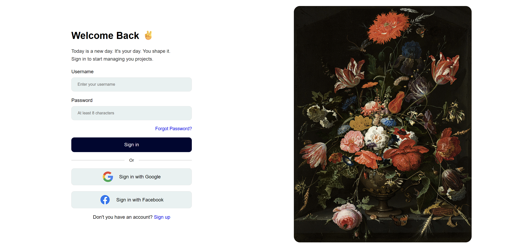

# Login Page

A clean, responsive **sign-in UI** built with plain HTML, CSS, and JavaScript — no frameworks, no build tools. Open `index.html` and you are ready to go.



---

## Overview

This mini project is a modern login screen with a split layout on desktop and a stacked layout on mobile. It focuses on layout, form UX, live validation, and a success modal with a blurred backdrop.

| Layer | Stack |
| --- | --- |
| Markup | HTML5 |
| Styles | CSS3 (Flexbox + media queries) |
| Logic | Vanilla JavaScript |

---

## Features

### Layout & Design
- Split-screen desktop layout: form on the left, artwork on the right
- Full-viewport container with light padding
- Image scaled to fill available height while keeping its aspect ratio
- Mobile layout under `900px`: image on top, form below, content capped at `400px` width
- Social buttons switch to a compact side-by-side style on mobile

### Form & Validation
- Username and password fields with clear labels and placeholders
- Live validation on `keyup`
- Empty-field checks on `blur`
- Rules currently enforced:
  - Username: at least **3** characters
  - Password: at least **8** characters
- Inline error messages shown/hidden with a `hidden` class

### Success Modal
- Opens only when both username and password pass validation
- Dimmed + blurred overlay so focus stays on the modal
- Close via **Continue**, or by clicking outside the modal

### Extra UI Pieces
- “Forgot Password?” link
- Divider with **Or** (desktop) / **Or sign in with** (mobile)
- Google and Facebook sign-in option buttons (UI only)
- Sign-up prompt at the bottom

---

## Project Structure

```text
Login Page/
├── index.html          # Page markup + success modal
├── style.css           # Layout, responsive styles, modal
├── script.js           # Validation + modal behavior
├── images/
│   ├── main.png        # Hero artwork
│   ├── Login Page.png  # README preview screenshot
│   ├── google.svg
│   └── facebook.svg
└── README.md
```

---

## Getting Started

1. Clone or download the repository.
2. Open the project folder.
3. Open `index.html` in your browser  
   *(or use a simple local server if you prefer).*

No install step. No dependencies.

---

## How to Try It

1. Enter a username with **3+** characters.
2. Enter a password with **8+** characters.
3. Click **Sign in**.
4. The success modal appears over a blurred page.
5. Click **Continue** (or the overlay) to close it.

Try short or empty values to see the error messages in action.

---

## What’s Ready to Use

| Area | Status |
| --- | --- |
| Desktop split layout | Done |
| Mobile responsive layout | Done |
| Form UI | Done |
| Live field validation | Done |
| Success modal + blur overlay | Done |
| Social login buttons | UI only (no real auth) |
| Backend / real authentication | Not included |

---

## Notes

This is a **front-end mini project** for UI and interaction practice. Social buttons and the sign-in flow do not connect to a real API yet — validation and the success modal are client-side only.
