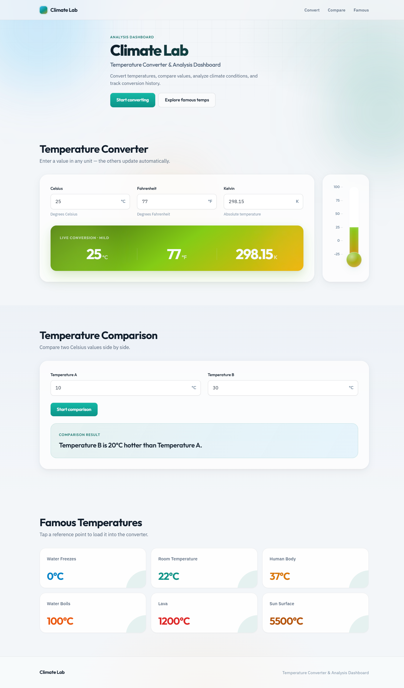
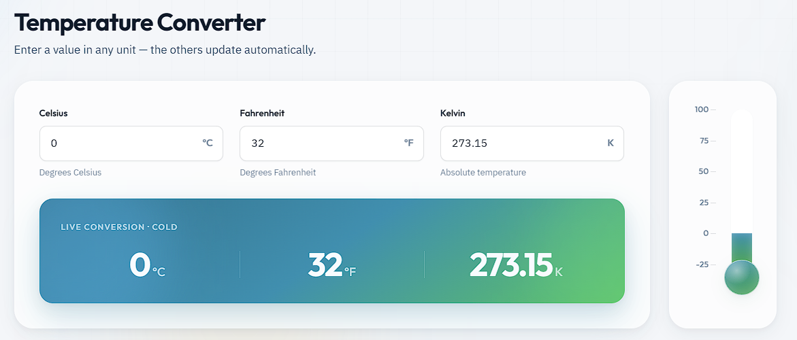
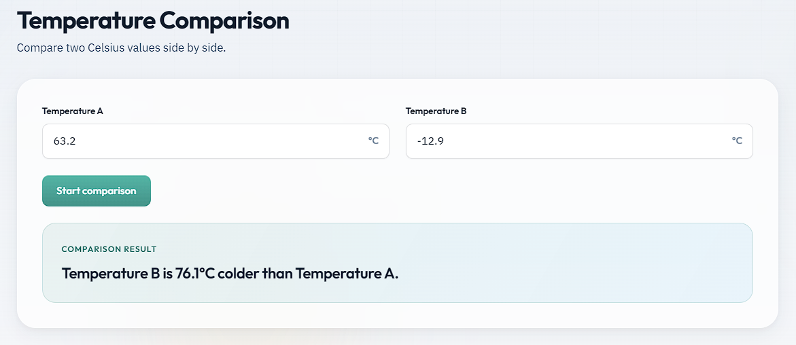
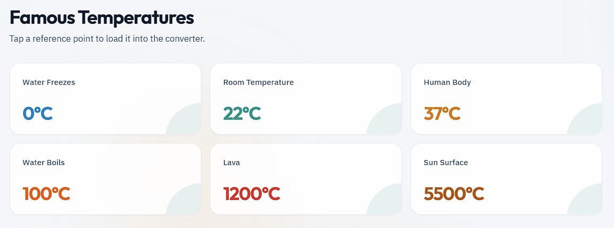

# Climate Lab

**Temperature Converter & Analysis Dashboard**

A modern, premium front-end mini project for converting temperatures, comparing values, and exploring famous climate reference points — with a live visual thermometer and temperature-aware theming.



---

## Overview

**Climate Lab** is a clean, SaaS-style temperature workspace. Enter a value in Celsius, Fahrenheit, or Kelvin and the rest of the interface updates instantly: conversions, live status colors, and the thermometer fill.

It is built as a lightweight static app — no frameworks, no build step — so you can open it in a browser and start using it right away.

---

## What you get

| Capability | Description |
| --- | --- |
| Instant conversion | Change any unit; the other two update automatically |
| Live result panel | Large summary of °C / °F / K with a climate status label |
| Dynamic theming | Panel and thermometer colors shift naturally with temperature |
| Visual thermometer | Scale from −25°C to 100°C with liquid height and color sync |
| Side-by-side compare | Compare two Celsius values with a clear hotter / colder result |
| Famous references | One-tap reference cards for well-known temperatures |
| Responsive UI | Works across desktop, tablet, and mobile layouts |

---

## Features

### Temperature Converter

Convert between **Celsius**, **Fahrenheit**, and **Kelvin** in real time. Invalid input is highlighted so mistakes are easy to spot.



**Highlights**

- Sync all three inputs from a single change
- Live conversion banner with status (Cold · Nature · Mild · Warm · Hot · Extreme)
- Glass-style thermometer beside the converter
- Liquid level and color follow the current Celsius value

**Theme logic (based on °C)**

- Below 0°C → cold blues  
- Near 0°C → blend between blue and green  
- 0°C to 25°C → nature greens  
- Near 25°C → blend toward warm tones  
- Above 25°C → warm reds  
- 50°C and above → deep dark reds  

---

### Temperature Comparison

Enter **Temperature A** and **Temperature B**, then press **Start comparison** to see which value is hotter or colder — and by how many degrees.



**Example result**

> Temperature B is 76.1°C colder than Temperature A.

---

### Famous Temperatures

Quick reference cards for iconic temperatures. Designed as clickable cards for loading values into the converter.



| Reference | Value |
| --- | --- |
| Water Freezes | 0°C |
| Room Temperature | 22°C |
| Human Body | 37°C |
| Water Boils | 100°C |
| Lava | 1200°C |
| Sun Surface | 5500°C |

---

## Tech stack

- **HTML5** — semantic sections, labels, accessible structure  
- **CSS3** — design tokens, glassmorphism, responsive grid, smooth transitions  
- **Vanilla JavaScript** — conversion math, theming, thermometer, comparison  

No npm install. No bundler. Just static files.

---

## Project structure

```text
Tempreture Lab/
├── index.html          # Page structure & UI
├── style.css           # Design system & layout
├── script.js           # Conversion, theme, comparison logic
├── images/
│   ├── Tempreture_Lab.png
│   ├── Temperature_Converter.png
│   ├── Temperature_Comparison.png
│   └── Famous_Temperatures.png
└── README.md
```

---

## Getting started

1. Clone or download this folder.
2. Open `index.html` in your browser  
   — or use a simple local server if you prefer:

```bash
# optional
npx serve .
```

3. Start converting temperatures.

---

## How to use

1. **Convert** — type into Celsius, Fahrenheit, or Kelvin; watch the live panel and thermometer update.  
2. **Compare** — enter two Celsius values and click **Start comparison**.  
3. **Explore** — browse Famous Temperatures for common climate reference points.

---

## Design notes

Climate Lab aims for a product-like feel rather than a classroom demo:

- Soft ambient gradients and subtle grid backdrop  
- Glass cards, soft shadows, and calm spacing  
- Clear typography (Outfit + IBM Plex Sans)  
- Motion reserved for meaningful feedback (theme, thermometer fill, hovers)

---

## License

This is a personal / portfolio mini project. Feel free to fork, learn from, and adapt it.
