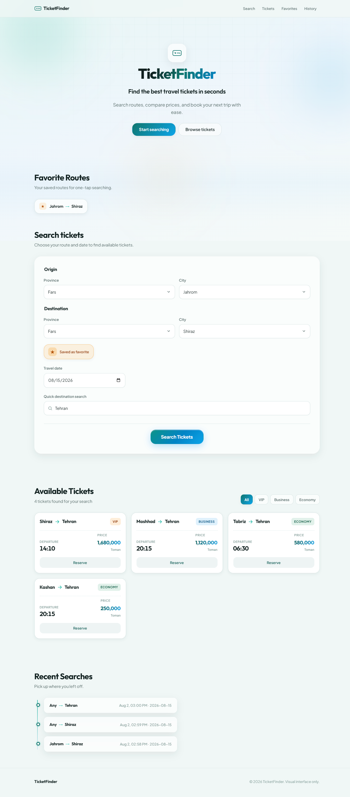
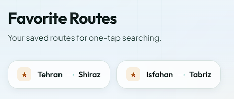
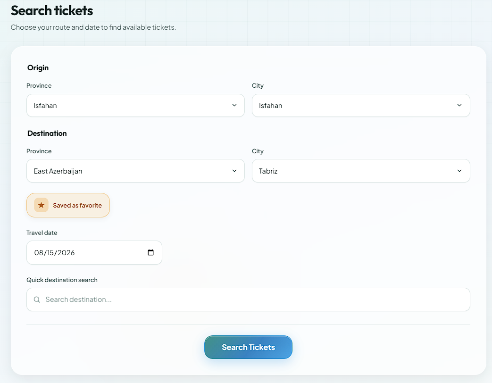
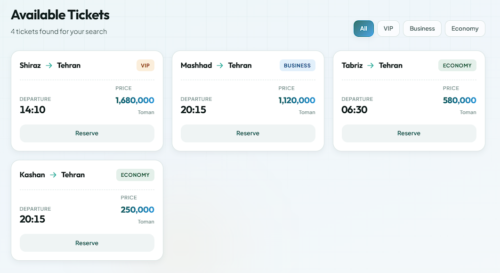
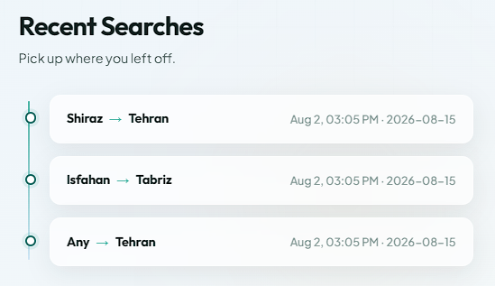

# TicketFinder

**Find the best travel tickets in seconds.**

A modern, one-page travel ticket search interface — designed and built as a front-end product demo with a clean SaaS look, responsive layout, and interactive search flows powered by mock flight data.



---

## Overview

TicketFinder lets users search routes across Iranian provinces and cities, save favorite routes, filter results by cabin class, and revisit their last searches — all in a single polished page.

| | |
|---|---|
| **Stack** | HTML · CSS · Vanilla JavaScript |
| **Data** | Mock `provinces` & `flights` datasets |
| **UI** | Glassmorphism, soft shadows, teal/sky brand palette |
| **Responsive** | Desktop · Tablet · Mobile |

---

## Features

### Favorite Routes

Save complete origin → destination routes with a star toggle. The section stays hidden until at least one favorite exists, then appears **above** the search form for one-tap reuse.



- Validates that province **and** city are set for both origin and destination before saving
- Active star state when the current route is already favorited
- Click a favorite chip to refill the search form

---

### Search Tickets

A premium search card for route-based and quick destination searches.



**Route search**
- Cascading province → city selects (populated from mock data)
- Travel date picker
- Save route as favorite

**Quick destination search**
- Type a city name and search to list **all** flights to that destination
- Does not require filling the origin/destination selects

---

### Available Tickets

Results appear only after a successful search. Matching flights are rendered as cards with route, cabin badge, departure time, and price.



- Dynamic ticket cards from filtered `flights` data
- Empty state: **No tickets found** when nothing matches
- Filters: **All · VIP · Business · Economy** (applied to the current result set)
- Live result count

---

### Recent Searches

Keeps the last **3** searches in memory and shows them in a timeline. Hidden until the user has searched at least once.



- Stores both route searches and quick-destination searches
- Duplicate searches move to the top instead of stacking
- Click an item to re-run that search

---

## What’s implemented

| Area | Status |
|------|--------|
| Hero & branding | Done |
| Province / city cascading selects | Done |
| Route search by origin, destination, date | Done |
| Quick destination search | Done |
| Dynamic results grid + empty state | Done |
| Cabin-type filters (All / VIP / Business / Economy) | Done |
| Favorite routes (validate → save → display) | Done |
| Recent searches (max 3, show/hide) | Done |
| Responsive layout | Done |
| Accessibility basics (labels, semantics, focus styles) | Done |

> **Note:** Reserve buttons and booking are visual only — no backend or payment flow.

---

## Project structure

```text
Ticket Finder/
├── index.html          # Page structure & UI
├── style.css           # Design system & responsive styles
├── script.js           # Data + interaction logic
├── images/             # README screenshots
│   ├── Ticket_Finder.png
│   ├── Favorite_Routes.png
│   ├── Search_Tickets.png
│   ├── Available_Tickets.png
│   └── Recent_Searches.png
└── README.md
```

---

## How to run

No build step or dependencies required.

1. Open `index.html` in a modern browser  
   **or**
2. Serve the folder with any static server, for example:

```bash
npx serve .
```

---

## How to try it

**Route search example**
1. Origin: `Tehran` → `Tehran`
2. Destination: `Fars` → `Shiraz`
3. Date: `2026-08-15`
4. Click **Search Tickets**

**Quick search example**
1. In Quick destination search, type `Tehran`
2. Click **Search Tickets** → all flights to Tehran appear

**Favorites**
1. Complete origin & destination
2. Click the star → route appears under Favorite Routes

---

## Design highlights

- Soft gradient background with ambient orbs and a subtle grid
- Glass-style search card and history items
- Teal → sky primary gradient for CTAs
- Clear hierarchy: brand → search → results → history
- Sections that appear only when they have content (Favorites, Results, Recent Searches)

---

## Tech notes

- **Provinces & cities** drive both select boxes and validation for favorites
- **Flights** are filtered in-memory (`filter`) — no API
- UI state is managed with meaningful IDs/classes so the DOM is easy to update from JS
- No frameworks — intentional for a clear front-end fundamentals demo

---

## License

Personal / educational project. Feel free to use it as a learning reference.
