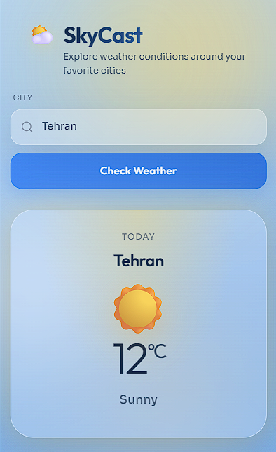
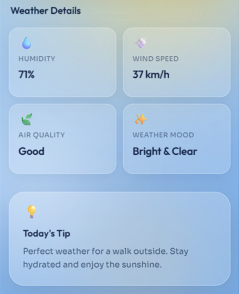
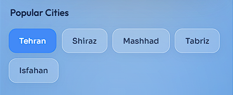

# SkyCast

**A mobile-first weather exploration app for Iranian cities.**

SkyCast lets you search a city, check its weather at a glance, and explore details like humidity, wind, air quality, and a daily tip — all in a clean, atmospheric mobile UI.

---

## Preview

### Header & Today Weather

The first screen users see: brand, city search, and today’s weather card.



### Weather Details

A quick look at humidity, wind speed, air quality, weather mood, and today’s tip.



### Popular Cities

One-tap access to the most popular cities, with the active city highlighted.



---

## What is this project?

SkyCast is a front-end mini project built with **HTML**, **CSS**, and **vanilla JavaScript**.  
It simulates weather data for selected Iranian cities and updates the interface dynamically when the user searches or picks a city.

The design is **mobile-first**, with glass-style cards, soft gradients, and theme changes based on weather conditions (sunny, windy, cloudy, rainy, snowy).

---

## What does it do?

- **Search by city** — type a city name and tap **Check Weather**
- **Show today’s weather** — city name, temperature (°C), icon, and condition
- **Show weather details** — humidity, wind speed, air quality, and weather mood
- **Show today’s tip** — a short suggestion based on the current condition
- **Popular cities** — quick select for Tehran, Shiraz, Mashhad, Tabriz, and Isfahan
- **Recent searches** — keeps the last 3 successful searches (hidden until the first search)
- **Dynamic themes** — background and atmosphere change with the weather state

---

## Supported cities

| City | Notes |
|------|--------|
| Tehran | Default city on load — Sunny |
| Shiraz | Windy |
| Mashhad | Cloudy |
| Tabriz | Rainy |
| Isfahan | Snowy |
| Karaj, Rasht, Qom, Yazd, Ahvaz, Kerman, Bandar Abbas | Random weather state |

Popular cities (Tehran, Shiraz, Mashhad, Tabriz, Isfahan) each have a **fixed, different** weather condition so you can demo all five moods. Other cities get a random condition between **0°C and 25°C**.

---

## Features in detail

### Search
Enter a city name in the input and press **Check Weather**.  
If the city is not in the list, an error message is shown.

### Today card
Displays:
- City name  
- Temperature  
- Weather icon & condition (Sunny, Windy, Cloudy, Rainy, Snowy)

### Weather details
Displays:
- Humidity  
- Wind speed  
- Air quality  
- Weather mood  

Plus a **Today’s Tip** matched to the current condition.

### Recent searches
- Not visible when the page first loads  
- After each successful search, up to **3** recent cities are listed  
- Tapping a recent city reloads that city’s weather  

---

## Tech stack

- **HTML5** — structure & accessibility-friendly markup  
- **CSS3** — mobile layout, glass cards, weather themes  
- **JavaScript (vanilla)** — city data, search logic, UI updates  

No frameworks. No build step. Open and run.

---

## How to run

1. Open the project folder  
2. Open `index.html` in your browser  

That’s it — no install or server required.

---

## Project structure

```text
Whather App/
├── index.html              # App markup
├── style.css               # Styles & weather themes
├── script.js               # Cities, weather data & interactions
├── images/
│   ├── Weather_Header.png  # Header & today weather screenshot
│   ├── Weather_Details.png # Details & tip screenshot
│   └── Popular_Cities.png  # Popular cities screenshot
└── README.md
```

---

## Summary

SkyCast is a presentational mobile weather UI that demonstrates search, dynamic content updates, themed states, and a polished front-end layout — ideal as a portfolio mini project.
